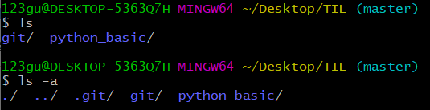
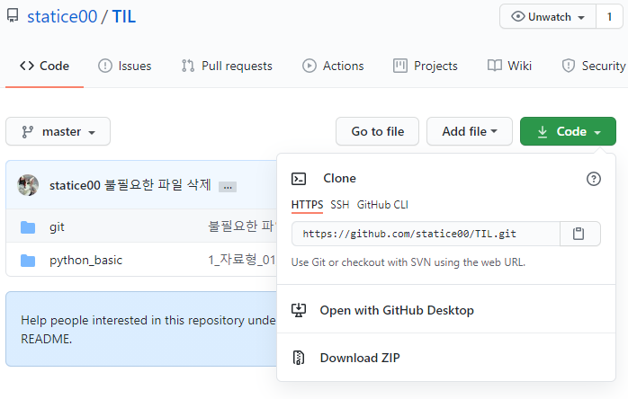

## git bash

1. 기초

 버전 확인

  ```bash
  git --version
  ```

현재 내가 있는 폴더에 어떤 폴더와 파일이 있는지 출력한다.

숨겨져 있는 폴더와 파일까지 출력하려면 -a 를 붙인다.(all)

.이 붙어 있으면 숨김처리된 폴더나 파일이다. (.git)

.  나자신  .. 나보다 상위(부모)

  ```bash
  ls
  ls -a
  ```



현재 내가 동작하고 있는 폴더의 위치를 출력한다. 

print working directory

  ```bash
  pwd
  ```

현재 작업공간 변경

change directory

~는 홈폴더 /는 최상단을 의미

  ```bash
  cd ~
  cd Desktop #바탕화면으로 이동
  ```

폴더 생성

make directory

 ```bash
 mkdir TIL # TIL이라는 이름의 폴더생성
 cd TIL    # TIL폴더로 이동
 ```

2. git 기본 사용법

git 저장소 만들기

git 저장소로 만들 폴더로 이동해 마우스 우측 버튼울 누르고 Git Bash Here를 클릭한다.

Git Bash Here를 클릭한 폴더 기준으로 디렉토리가 잡힌다.

 ```bash
 git init    # initialize  .git이라는 하위 디렉토리를 생성
             # .git 디렉토리에는 저장소에 필요한 뼈대 파일이 들어 있음
             # .git 으로 생성되었으므로 ls -a로 확인가능
             # 오른쪽에 (master) 가 떠있어야 git으로 관리되는 중임
 ```

git 저장소에 파일 추가하기 (**git add**)

 ```bash
 touch a.txt # touch : 파일을 생성
 git status  # 현재 저장소의 상태 확인
             # 아무것도 없으면 git add를 써서 tracking되는 파일을 만들라고 뜸
 git add a.txt  # a.txt 파일을 staging area에 add
                # git status 다시 실행해보면 a.txt파일이 staging area에 올라간것을 확인
 ```

사용자 설정

git을 처음 사용한다면 commit 명령 전에 사용자를 설정해야 한다.

 ```bash
 git config --global user.email " 123gusdyd@gmail.com"
 git config --global user.name "statice00"
 ```

commit 남기기 (**git commit**)

-m : vim에서 별도의 메세지를 작성할 필요없이 인라인 형식으로 바로 커밋 메세지 작성

 ```bash
 git commit -m "my first commit"                 
 ```

커밋 히스토리 조회

고유값과 작성한 시간, 작성한 메세지 등등

--oneline : 로그를 한줄로 보여줌

 ```bash
 git log
 git log --oneline
 ```

**git push**

깃허브에서 repository 생성 후 주소복사해 origin이라는 별명의 remote repo생성

-v : 원격저장소의 별명과 실제주소 확인

 ```bash
 git remote add origin https://github.com/statice00/TIL.git
 git remote -v
 ```

깃허브 원격저장소에 보내기

 ```bash
 git push origin master
 ```


